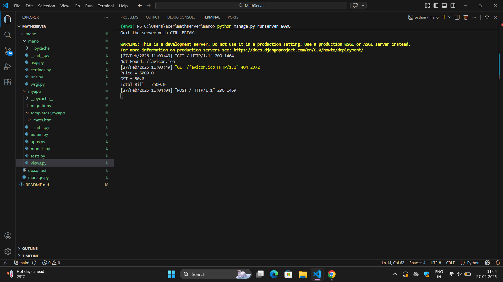
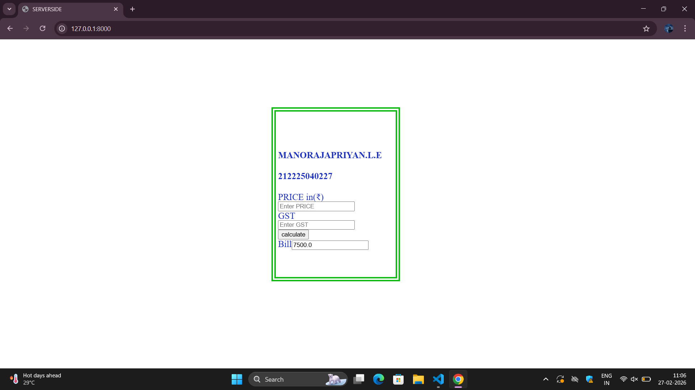

# Ex.04 Design a Website for Server Side Processing
## Date:27/02/26

## AIM:
To create a web page to calculate total bill amount with GST from price and GST percentage using server-side scripts.

## FORMULA:
Bill = P + (P * GST / 100)
<br> P --> Price (in Rupees)
<br> GST --> GST (in Percentage)
<br> Bill --> Total Bill Amount (in Rupees)

## DESIGN STEPS:

### Step 1:
Clone the repository from GitHub.

### Step 2:
Create Django Admin project.

### Step 3:
Create a New App under the Django Admin project.

### Step 4:
Create a HTML file to implement form based input and output.

### Step 5:
Create python programs for views and urls to perform server side processing.

### Step 6:
Receive input values from the form using request.POST.get().

### Step 7:
Calculate the total bill amount (including GST).

### Step 8:
Display the calculated result in the server console.

### Step 9:
Render the result to the HTML template.

### Step 10:
Publish the website in Localhost.

## PROGRAM:
```
math.html
<html>
<head>
    <title>
        SERVERSIDE 
    </title>
    <style>
        .box
        {
            padding:  60px;
            padding-left: 5px;
            background-color: cyan (0, 0, 0);
            border: double 10px rgb(20, 187, 23);
            line-height: 20px;
            width: 200;
            font-size: 20px;
            color:rgb(26, 48, 189);
            position: fixed;
            top: 150px;
            left:600px;

        }
        .object
        {
            border: 5px dashed rgb(15, 206, 53);
            padding: 40px;
            background-color: white;
        }
    </style>

</head>
<body>
    <form method="post">
        <div class="box">
        <h4>MANORAJAPRIYAN.L.E </h4>
        <h4>212225040227</h4>
           
            <div class="objec1">
                <label >PRICE </label>
                in(<span>&#8377;</span >)</label>

                <input type="number" name="Price" value="{{p}}" placeholder="Enter PRICE ">
                <br>
                
                <label>GST</label>
                <input type="text" name="GST" value="{{gst}}" placeholder="Enter GST">
                <br>

                <input type="submit" value="calculate"> 
                <br>
                <label>Bill</label><input type="text" value="{{ bill }}">

            </div>
     </form>
</body>
</html>

views.py
from django.shortcuts import render
def calculate_bill(request):
    bill = 0

    if request.method == 'POST':
        p = float(request.POST.get('Price', 0))
        gst = float(request.POST.get('GST', 0))
        bill = p + (p * gst / 100)

        print("Price =", p)
        print("GST =", gst)
        print("Total Bill =", bill)

    return render(request, 'myapp/math.html', {'bill': bill})

urls.py
from django.contrib import admin
from django.urls import path
from myapp import views

urlpatterns = [
    path('admin/',admin.site.urls),
    path('', views.calculate_bill, name='calculate_bill'),
]

```

## OUTPUT - SERVER SIDE:


## OUTPUT - WEBPAGE:


## RESULT:
The a web page to calculate total bill amount with GST from price and GST percentage using server-side scripts is created successfully.
